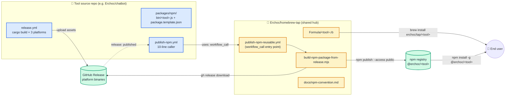
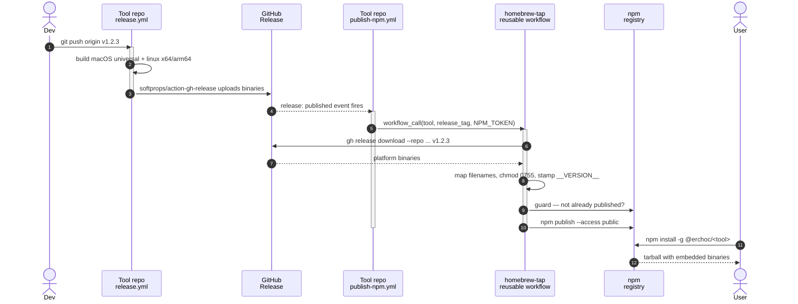

# Homebrew Tap · npm channel

[English](README.md) · [中文](README_CN.md)

Dual-channel distribution hub for [@Erchoc](https://github.com/Erchoc)'s CLI
tools. Every tool ships through two equivalent channels:

```bash
brew install erchoc/tap/<tool>    # Homebrew
npm  install -g @erchoc/<tool>    # npm
```

Both deliver the exact same pre-built binary from the tool's own GitHub
Release.

---

## How the pipeline fits together



Every tool repo stays in charge of its own release narrative (blue). The tap
(yellow) holds the **shared infrastructure** every tool reuses — a single
reusable workflow, a single build script, a single spec. Upgrading the hub
upgrades all tools at once.

## What happens on `git push --tags`



One tag push, one release workflow, and the npm channel tracks automatically.
The brew channel updates on a separate formula bump in this repo (manual PR
for now).

---

## Install

```bash
# Homebrew
brew install erchoc/tap/<formula>

# npm
npm install -g @erchoc/<tool>
```

> The leading `@` is required. `npm install -g erchoc/<tool>` (without `@`)
> is npm's GitHub shorthand and will try to clone `github.com/erchoc/<tool>`
> instead — that is **not** the same thing.

No `postinstall` download, no network at install time, works under
`--ignore-scripts`. Supports macOS (arm64 + x64) and Linux (x64 + arm64).

## Available tools

| Tool | Description | Source | Homebrew | npm |
|------|-------------|--------|----------|-----|
| [cb](Formula/cb.rb) | Cross-platform voice assistant for the terminal | [Erchoc/chatbot](https://github.com/Erchoc/chatbot) | `brew install erchoc/tap/cb` | `npm install -g @erchoc/cb` |

## Verify an install

```bash
# Homebrew
which cb                          # → $(brew --prefix)/bin/cb
cb --version

# npm
npm ls -g --depth=0 @erchoc/cb    # confirm scoped package installed
which cb                          # → <npm-prefix>/bin/cb
cb --version
```

---

## What this repo provides

- **Homebrew formulae** under `Formula/` — one `.rb` per tool.
- **Reusable GitHub Actions workflow**
  [`.github/workflows/publish-npm-reusable.yml`](.github/workflows/publish-npm-reusable.yml) —
  every tool repo calls this to publish its own `@erchoc/<tool>`.
- **Shared build script**
  [`npm/scripts/build-npm-package-from-release.mjs`](npm/scripts/build-npm-package-from-release.mjs)
  (invoked by the reusable workflow).
- **Packaging spec** at [`docs/npm-convention.md`](docs/npm-convention.md).
- **Starter template** at
  [`templates/npm/tool-template/`](templates/npm/tool-template/).

## Repo layout

```
homebrew-tap/
├── Formula/                                # one .rb per tool (Homebrew side)
├── npm/scripts/
│   └── build-npm-package-from-release.mjs  # shared build script
├── templates/npm/tool-template/            # starter kit for tool repos
├── docs/npm-convention.md                  # @<org>/<tool> packaging spec
└── .github/workflows/
    ├── test.yml                            # brew style/audit/install
    └── publish-npm-reusable.yml            # workflow_call entry point
```

## Adding a new tool

1. **Homebrew side** — add `Formula/<tool>.rb`. Bump `version` + per-platform
   `sha256` on each release.
2. **npm side** — copy [`templates/npm/tool-template/`](templates/npm/tool-template/)
   into the tool's own source repo (as `npm/` at root, or `packages/npm/`
   inside a monorepo). Follow
   [`docs/npm-convention.md`](docs/npm-convention.md).

Per-tool-repo prereqs:
- `NPM_TOKEN` secret (granular Automation token, write access to `@erchoc`).
  An **organisation** secret shared across all Erchoc repos is recommended.
- The tool's existing release workflow must upload assets whose filenames
  contain a recognised platform keyword (see spec §7).
