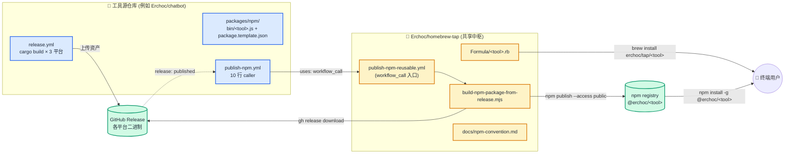
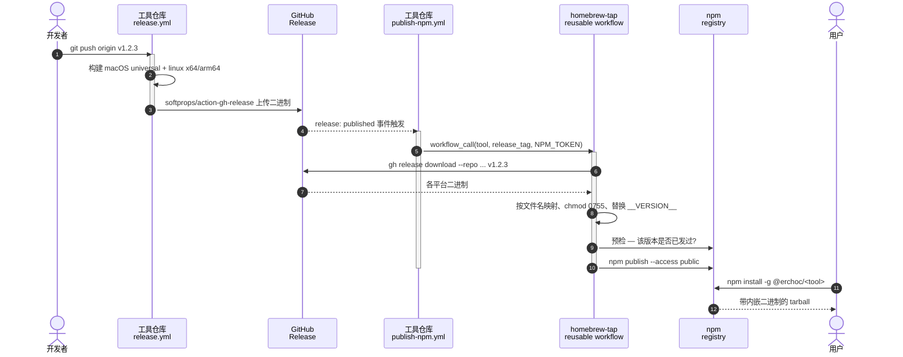

<p align="center">
  
</p>

# Homebrew Tap · npm 分发

[English](README.md) · [中文](README_CN.md)

[@Erchoc](https://github.com/Erchoc) 命令行工具的双通道分发中心。每个工具都通过两条等价通道分发：

```bash
brew install erchoc/tap/<tool>    # Homebrew
npm  install -g @erchoc/<tool>    # npm
```

两条通道交付的是同一份来自工具 GitHub Release 的预编译二进制。

<details>
<summary><b>整条流水线长这样</b>——点开看架构图</summary>

<br>



每个工具仓库自己掌控发版节奏（蓝色）。Tap（黄色）是所有工具复用的**共享基础设施**——
一份 reusable workflow、一份构建脚本、一份规范文档。升级中枢一次，所有工具同步受益。

</details>

<details>
<summary><b><code>git push --tags</code> 之后发生了什么</b>——点开看时序图</summary>

<br>



一次 tag push，一轮 release workflow，npm 通道自动跟上。brew 通道目前是本仓库
单独改 formula 触发（下一步会接自动化）。

</details>

---

## 安装

```bash
# Homebrew
brew install erchoc/tap/<formula>

# npm
npm install -g @erchoc/<tool>
```

> **`@` 前缀必须加**。`npm install -g erchoc/<tool>`（没有 `@`）是 npm 的
> GitHub shorthand，会尝试 clone `github.com/erchoc/<tool>`——和这里的 npm
> 包完全是两回事。

安装过程**不执行 postinstall、不联网下载**，兼容 `--ignore-scripts`。支持
macOS（arm64 + x64）与 Linux（x64 + arm64）。

## 可用工具

| 工具 | 说明 | 源仓库 | Homebrew | npm |
|------|------|--------|----------|-----|
| [cb](Formula/cb.rb) | 住在终端里的跨平台语音助手 | [Erchoc/chatbot](https://github.com/Erchoc/chatbot) | `brew install erchoc/tap/cb` | `npm install -g @erchoc/cb` |

## 安装后自检

```bash
# Homebrew
which cb                          # → $(brew --prefix)/bin/cb
cb --version

# npm
npm ls -g --depth=0 @erchoc/cb    # 确认 scoped 包已装
which cb                          # → <npm-prefix>/bin/cb
cb --version
```

---

## 本仓库提供什么

- **Homebrew 公式**（`Formula/` 下，每工具一份 `.rb`）
- **可复用 GitHub Actions workflow**
  [`.github/workflows/publish-npm-reusable.yml`](.github/workflows/publish-npm-reusable.yml)——每个工具仓库调用它发布自己的
  `@erchoc/<tool>`
- **共享构建脚本**
  [`npm/scripts/build-npm-package-from-release.mjs`](npm/scripts/build-npm-package-from-release.mjs)（被
  reusable workflow 调用）
- **打包规范** [`docs/npm-convention.md`](docs/npm-convention.md)
- **起点模板** [`templates/npm/tool-template/`](templates/npm/tool-template/)

## 仓库结构

```
homebrew-tap/
├── Formula/                                # Homebrew 公式
├── npm/scripts/
│   └── build-npm-package-from-release.mjs  # 共享构建脚本
├── templates/npm/tool-template/            # 工具仓库起点模板
├── docs/npm-convention.md                  # @<org>/<tool> 打包规范
└── .github/workflows/
    ├── test.yml                            # brew style/audit/install
    └── publish-npm-reusable.yml            # workflow_call 入口
```

## 新增一个工具

1. **Homebrew 侧** — 在本仓库加 `Formula/<tool>.rb`，每次发版更新 `version` 和各平台 `sha256`。
2. **npm 侧** — 把 [`templates/npm/tool-template/`](templates/npm/tool-template/) 拷到工具仓库中，放在 `npm/`（单包）或 `packages/npm/`（monorepo）下。按 [`docs/npm-convention.md`](docs/npm-convention.md) 落地。

每个工具仓库的前置条件：
- `NPM_TOKEN` secret（granular Automation token，对 `@erchoc` scope 有写权限）。
  推荐用 GitHub **组织级** secret，一次配置所有 Erchoc 仓库共享。
- 工具仓库的 release workflow 产出的资产文件名必须包含约定的平台关键词（见规范 §7）。
